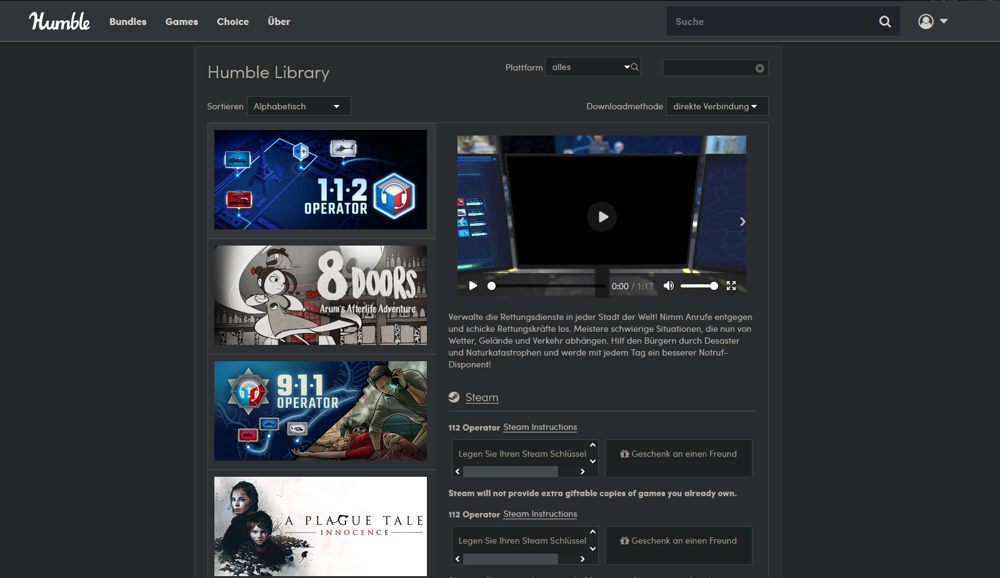
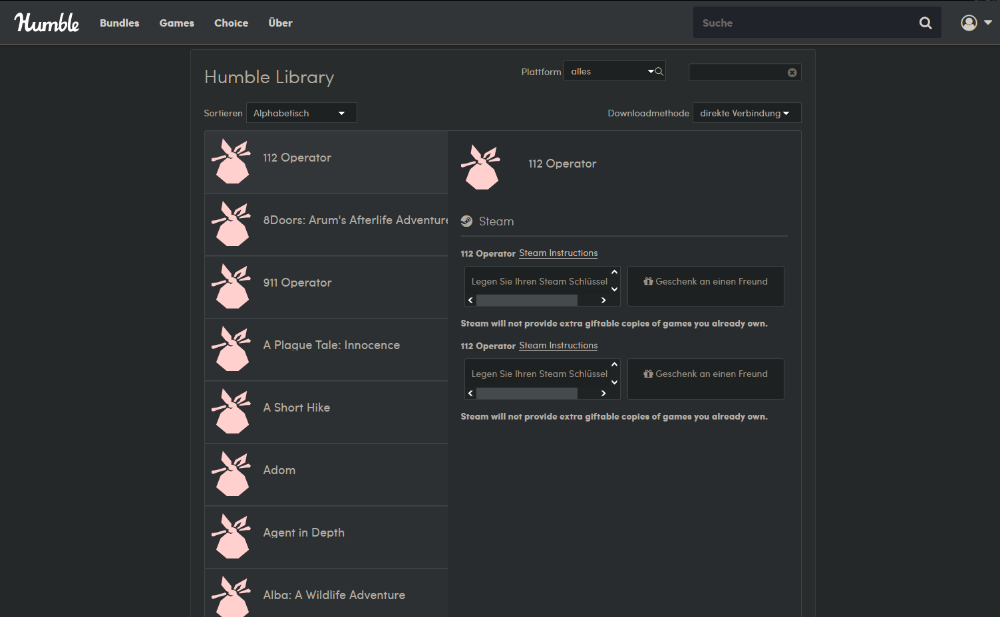

# Humble Bundle Library Steam View
Adds game information of Steam games in the Humble Bundle library.  

I was getting annoyed very often that, whenever I was browsing through my Humble Bundle library with 300+ titles, I had to look up every Steam game individually. So last sunday I finally snapped and wrote a very simple javascript plugin for Firefox that displays a little gallery alongside the game's description and its banner. It will automatically display the game information in your language.  

The javascript behind the plugin is very simple, that's why some games are not found if their title slightly differs. Also, since I change the site's entire HTML structure, clicking "Sort by.." will break the gallery view and force you to reload.

If you were just as annoyed as me, feel free to check it out!  
[HumbleBundleLibrarySteamView Firefox Addon](https://addons.mozilla.org/de/firefox/addon/humblebundlelibrarysteamview/)

  
Overview of the modified Humble Bundle library page with the gallery view.  
  
  
The standard look of the Humble Bundle library without the add-on.
